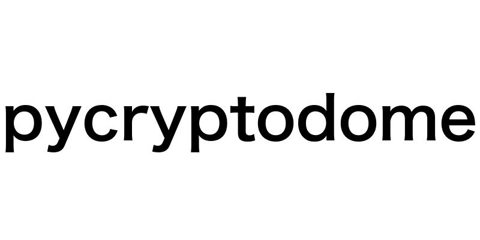

# Image Encryption and Decryption Project

## Language Used: 

## Libraries Used:

      
    

## About:
The application is a client-server image encryption and decryption system built using Python. It integrates AES (Advanced Encryption Standard), DES(Data Encryption Standard) and RSA (Rivest-Shamir-Adleman) encryption algorithms to provide secure image transmission over a network. 

## Features:

1.	Hybrid Encryption Approach
2.	Client-Side Operations
3.	Server-Side Operations
4.	Clean File Structure
5.	Ample Security Considerations

<b>
Project.pdf is given along for better understanding of worflow of the given application
<b>

<u>Any suggestions, improvements, and feedback is welcome.</u>
